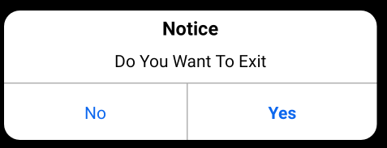
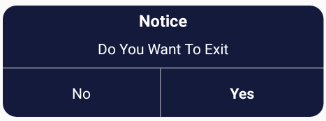

# Simple_Java_Library

*** Exit Ios Dialog ☝☝☝***
***And more it is coming soon***

# Code For Add

***first add this  

  import com.android.prime.simple_java_library.Exit_Ios_Dialog;***

-And add the code for  light ios dialog

 #### Exit_Ios_Dialog.NewIosDialogShow( MainActivity.this, "notice", "your massage", "yes", "no" );

- for dark ios dialog

#### Exit_Ios_Dialog.NewIosDarkDialogShow( MainActivity.this,"notice","your massage","yes","no" );

Step 1.Add it in your root build.gradle at the end of repositories:

	allprojects {

		repositories {

			...

			maven { url 'https://jitpack.io' }

		}

	}

Step 2. Add the dependency

	dependencies {

	       dependencies {
	        implementation 'com.github.abodinagdat16:Simple_Java_Library:1.3'
	}

	}
